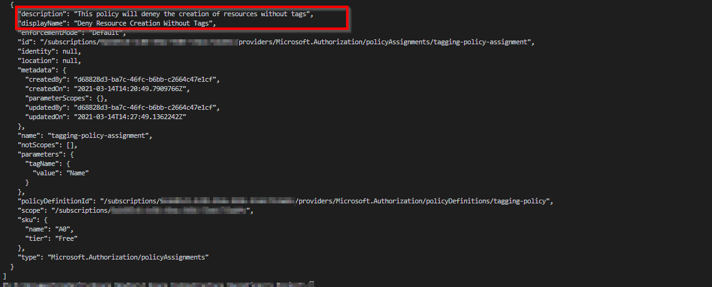
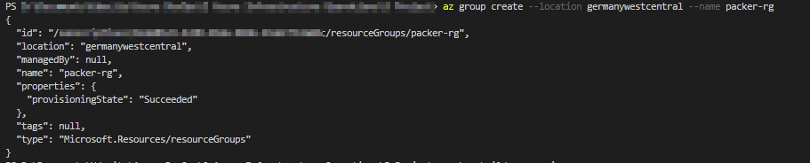
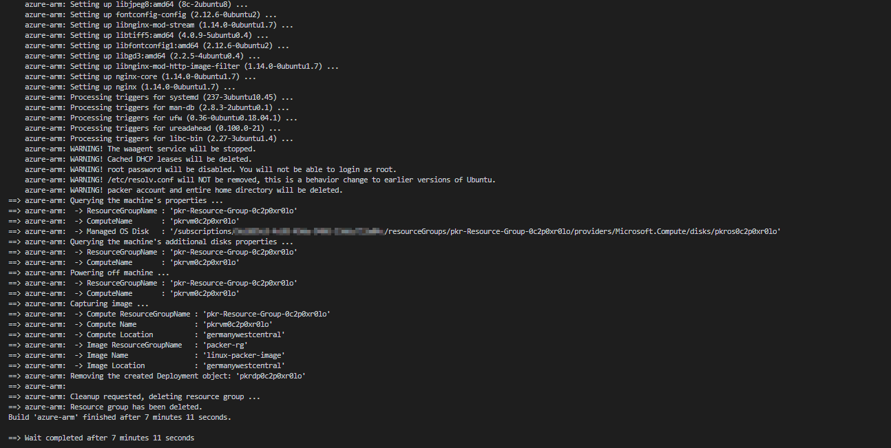
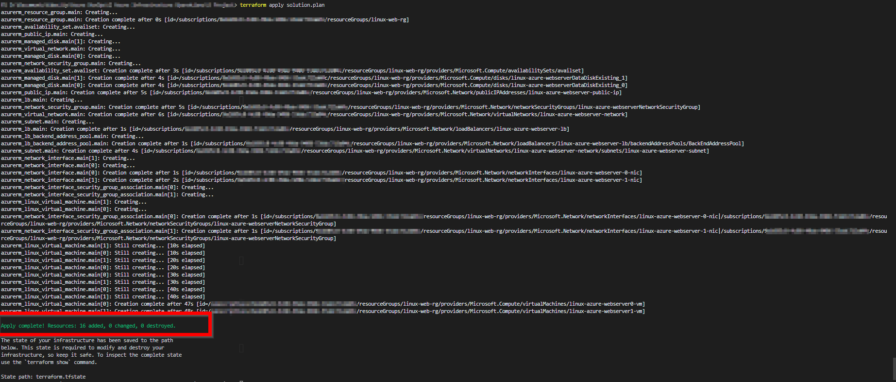

#  Azure Infrastructure Operations : Deploying a scalable IaaS web server in Azure

### Introduction

This solution uses Packer and Terraform to deploy a customisable and scalable Web Server in Azure. The solution uses Packer to define an Ubuntu Image and Terraform to deploy a scalable cluster of servers behind a load balancer which manages incomming traffic. 

### Getting Started

1. Clone this repository

2. Create your infrastructure as code

3. Update this README to reflect how someone would use your code.

### Dependencies

1. Create an [Azure Account](https://portal.azure.com)
2. Install the [Azure command line interface](https://docs.microsoft.com/en-us/cli/azure/install-azure-cli?view=azure-cli-latest)
3. Install [Packer](https://www.packer.io/downloads)
4. Install [Terraform](https://www.terraform.io/downloads.html)

### Instruction
1. After installation and configuration of **all dependancies**, log into your tenant by running: ` az login`
2. Create an Azure Policy: To restrict resource creation without tags, create a policy by running the below commands from the same directory as the tagging-policy.json, tagging-policy-params.json and params.json
   1. `az policy definition create --name tagging-policy --display-name "Deny Resource Creation Without Tags" --description "This policy will deney the creation of resources without tags" --rules tagging-policy.json --params tagging-policy-params.json --mode Indexed `
   2. `az policy assignment create --name tagging-policy --display-name "Deny Resource Creation Without Tags" --description "This policy will deney the creation of resources without tags" --policy tagging-policy --params params.json ` 
   3. To view all policies run : ` az policy assignment list ` , an example image of the implemented policy can be seen below in the Output Section. 
3. Create a resource group called packer-rg: 
   1. ` az group create --location germanywestcentral --name packer-rg `
   2. Ensure you replace the location with your location 
4. Create a Service Principle.
   1. For security reasons it is recommended to create a Service Principle, more information can be found  [here](https://docs.microsoft.com/en-us/powershell/azure/create-azure-service-principal-azureps?view=azps-5.6.0#:~:text=An%20Azure%20service%20principal%20is,accessed%20and%20at%20which%20level.)
   2. To create a Service Principle run the following command:` az ad sp create-for-rbac --role="Contributor" --name="TerraformSP"`
   3. The above command will output the below variables:
       - appId
       - displayName
       - name
       - password
       - tenant
   4. From the above output, create 3 environment variables. These variables will be used in the Packer template in Step 5
      - ARM_CLIENT_ID = appId value
      - ARM_CLIENT_SECRET = password value
      - ARM_TENANT_ID = tenant value
   5. To get your Subscription ID, run  ` az account list ` , your Subscription ID is also available in the Azure Portal
   6. Add the Subscription ID to an Environment Variable called ARM_SUBSCRIPTION_ID 
5. Configure and Deploy a Packer Image
   1. Ensure the data in the server.js file corresponds to the environment variables described above.
   2. Update server.json to reflect your requirements i.e.:
      - **image_sku**: The default is Ubuntu 18.04-LTS
      -  **location**: The default location is germanywestcentral
      -  **vm_size**: The default VM Size is Standard_B1s
   3. To create the Packer Image Run: `packer build server.json`
      1. If you did not create the environment variables as mentioned in step 3 or do not want to create an environment variable your can run `packer build -var 'key=value server.json` where key and value are the required variables.
6. Deploy to Azure with Terraform
   1. The file **vars.tf** contains the solution variables, update the variables to meet your requirements i.e:
      1. **prefix**: The default prefix for the solution
      2. **location**: The location the solution will be deployed to
      3. **resource_group**: The name of the resource group that will be created
      4. **tags**: Defines the tags used for this solution. ⚠️ If you do not define a tag, you will not be able to deploy the solution due to the tagging policy created in Step 1
      5. **packer_resource_group**: This should correspond to the resource group created in step 3, and correspond to the entry called "managed_image_resource_group_name" in server.json
      6. **packer_image_name**: This should correspond to the field "managed_image_name" in server.json
      7. **num_of_vms**: Defines the number of VMS created, the default is 2
   1. Deploy to Azure by running:
      1. `terraform init` 
      2. `terraform plan -out solution.plan`
      3. `terraform apply solution.plan`
   2. To destroy resources created by Terraform:  `terraform destroy`
   3. To destroy resources created by Packer: `az image delete -g packer-rg -n linux-packer-image`
   

### Output

1. Output of the implemented Tagging Policy
   
2. Output of creating a resource group called packer-rg
   
4. Output of creating the Packer Image
   
5. Output Terraform Apply
  
